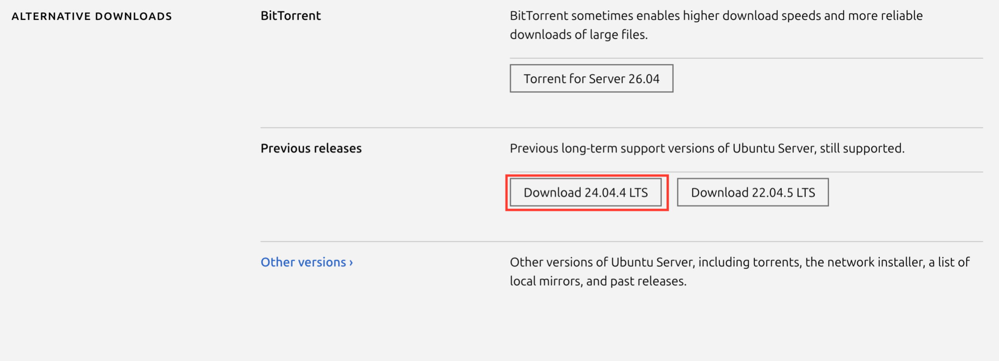

# 1-1. VM 직접 체험 — VirtualBox로 Ubuntu 서버 구축하기

## 실습 목표

이 가이드는 다음을 직접 경험하는 데 목적이 있습니다.

- VirtualBox에 Ubuntu 24.04 VM 설치 및 실행
- VM 부팅 속도가 느리다는 점 체감
- VM 내부에 Nginx 설치 후 포트포워딩으로 로컬 브라우저에서 확인
- Docker 설치 후 Nginx를 한 번에 실행하여 VM 방식과 비교

## 준비물

- Windows/macOS/Linux PC
- 인터넷 연결
- 관리자 권한

## 공식 다운로드 링크

- [VirtualBox 공식 다운로드](https://www.virtualbox.org/wiki/Downloads){target=_blank}
- [Ubuntu Server 24.04 LTS 다운로드](https://ubuntu.com/download/server){target=_blank}
- [Docker Engine (Ubuntu) 설치 문서](https://docs.docker.com/engine/install/ubuntu/){target=_blank}
- [Docker Desktop (Windows/macOS)](https://www.docker.com/products/docker-desktop/){target=_blank}

## 1) VirtualBox 설치

!!! warning "Windows 사용자 — 설치 전 확인"
    Windows에서 **Hyper-V**가 활성화되어 있으면 VirtualBox가 정상적으로 실행되지 않을 수 있습니다.
    설치 전에 PowerShell을 **관리자 권한**으로 열고 아래 명령어를 실행하세요.

    ```powershell
    bcdedit /set hypervisorlaunchtype off
    ```

    실행 후 **반드시 재부팅**합니다. (VirtualBox 설치는 재부팅 후 진행하세요.)

1. [VirtualBox 공식 다운로드 페이지](https://www.virtualbox.org/wiki/Downloads){target=_blank}에서 최신 버전을 다운로드합니다.
2. 기본 옵션으로 설치합니다.
3. 설치 완료 후 VirtualBox를 실행합니다.

## 2) Ubuntu Server 24.04 이미지 준비

!!! warning "반드시 24.04 LTS를 다운로드하세요"
    현재 Ubuntu 공식 사이트 기본 다운로드는 **26**입니다.
    이 실습은 **24.04 LTS** 기준으로 작성되었으므로, 아래 안내에 따라 **Previous releases**에서 24.04를 선택해야 합니다.

1. [Ubuntu 공식 다운로드 페이지](https://ubuntu.com/download/server){target=_blank}에 접속합니다.
2. 페이지를 아래로 스크롤하여 **Previous releases** 섹션에서 `Ubuntu Server 24.04 LTS`를 선택합니다.

    

3. ISO 파일을 다운로드합니다.
4. 파일명을 확인합니다. 예: `ubuntu-24.04.2-live-server-amd64.iso`

## 3) VM 생성

### 기본 정보 입력

1. VirtualBox에서 `새로 만들기`를 클릭합니다.
2. 아래와 같이 입력합니다.

    | 항목 | 값 |
    |------|-----|
    | 이름 | `docker-lab` |
    | ISO Image | 다운로드한 `ubuntu-24.04.x-live-server-amd64.iso` 선택 |
    | 유형 | Linux |
    | 버전 | Ubuntu (64-bit) |

3. **Skip Unattended Installation** 체크박스를 **체크**합니다.

### Username / Password 설정

!!! info "계정 정보"
    - **Username**: `vboxuser` (기본값 그대로 사용)
    - **Password**: 원하는 비밀번호로 변경 가능합니다. 단, 잊지 않도록 메모해 두세요.

### Specify Virtual Hardware (하드웨어 설정)

4. `Next`를 눌러 **Specify Virtual Hardware** 단계로 이동합니다.
5. 아래와 같이 설정합니다.

    | 항목 | 값 |
    |------|-----|
    | Base Memory | **4096 MB** |
    | Processors | **2** |

    !!! warning "메모리·CPU가 부족하면 설치 중 멈춤 현상이 발생할 수 있습니다."

### 디스크 설정

6. `Next`를 눌러 **Virtual Hard Disk** 단계로 이동합니다.
7. **Create a Virtual Hard Disk Now** 선택 후 디스크 크기를 기본값 **25GB** 그대로 사용합니다.
8. `Next` → `Finish`를 클릭해 VM 생성을 완료합니다.

## 4) VM 부팅 및 Ubuntu 설치

1. VM을 시작합니다.
2. Ubuntu 설치 마법사를 따라 설치합니다.
3. 설치가 완료되면 VM이 재시작되고 로그인 화면이 나타납니다. 로그인 후 다음 단계를 이어서 진행합니다.

## 5) VM 부팅 속도 체감 포인트

아래를 체크해보세요.

- 전원 ON 후 로그인 화면까지 걸리는 시간
- 로그인 후 데스크톱이 완전히 준비되는 시간
- 브라우저/터미널 첫 실행 반응 속도

이 단계에서 "운영체제 전체를 부팅하는 비용"이 있다는 점을 기억합니다.

## 6) VM 내부에 Nginx 설치

VM 터미널에서 실행합니다.

```bash
sudo apt update
sudo apt install -y nginx
sudo systemctl enable nginx
sudo systemctl start nginx
sudo systemctl status nginx --no-pager
```

정상 동작 확인:

```bash
curl -I http://localhost
```

`HTTP/1.1 200 OK`가 보이면 정상입니다.

## 7) 포트포워딩 설정 (Host -> VM)

목표: 내 PC 브라우저에서 `http://localhost:8080` 접속 시 VM의 Nginx 페이지 표시

1. VirtualBox에서 `docker-lab` VM을 클릭합니다.
2. 상단 메뉴 `설정` → `네트워크` → `포트 포워딩`을 클릭합니다.
3. 아래 규칙을 추가합니다.

    | 이름 | 프로토콜 | 호스트 포트 | 게스트 포트 |
    |------|---------|-----------|-----------|
    | nginx | TCP | 8080 | 80 |

    !!! info "호스트 포트 vs 게스트 포트"
        - **호스트 포트 (8080)**: 내 PC에서 접속할 포트입니다. 브라우저에서 `http://localhost:8080`으로 접속하면 이 포트로 요청이 들어옵니다.
        - **게스트 포트 (80)**: VM 내부에서 Nginx가 실제로 열고 있는 포트입니다.
        - 즉, `내 PC:8080` → `VM:80` 으로 연결되는 구조입니다.

4. 호스트(내 PC) 브라우저에서 `http://localhost:8080` 접속

Nginx Welcome 페이지가 보이면 성공입니다.

## 8) 다음 실습을 위한 SSH 설치

이후 실습에서 호스트 터미널에서 VM에 직접 접속해 명령어를 복붙할 수 있도록 SSH를 미리 설치합니다.

VM 터미널에서 실행합니다.

```bash
sudo apt install -y openssh-server
sudo systemctl enable ssh
sudo systemctl start ssh
```

포트포워딩에 SSH 규칙을 추가합니다.

| 이름 | 프로토콜 | 호스트 포트 | 게스트 포트 |
|------|---------|-----------|-----------|
| ssh | TCP | 2222 | 22 |

이후 호스트(내 PC) 터미널(macOS: Terminal, Windows: PowerShell)에서 아래 명령어로 VM에 접속할 수 있습니다.

```bash
ssh -p 2222 vboxuser@localhost
```

!!! tip
    SSH 접속 후에는 터미널에서 복사·붙여넣기가 자유롭게 됩니다. 이후 실습부터는 SSH로 접속해서 진행하세요.

## 9) 호스트 전용 네트워크 설정 (Host-Only)

포트포워딩 없이 Mac에서 VM으로 직접 접근하기 위해 **호스트 전용 어댑터**를 추가하고 고정 IP를 할당합니다.

### VirtualBox 어댑터 추가

1. `docker-lab` VM 설정 → `네트워크` → **어댑터 2** 탭 클릭
2. **사용하기** 체크
3. 다음에 연결됨: **호스트 전용 어댑터** 선택
4. 확인 후 VM 재시작

### 고정 IP 설정 (Netplan)

SSH로 접속 후 관리자 권한으로 전환합니다.

```bash
sudo su
```

!!! info "sudo su 란?"
    `sudo su` 는 일반 사용자에서 **root(관리자)** 로 전환하는 명령어입니다.
    `/etc/netplan/` 같은 시스템 파일은 관리자 권한이 없으면 읽거나 수정할 수 없습니다.
    프롬프트가 `vboxuser@docker-lab:~$` 에서 `root@docker-lab:~#` 으로 바뀌면 전환된 것입니다.

Netplan 설정 파일을 열어 `enp0s9` 인터페이스를 추가합니다.

```bash
nano /etc/netplan/50-cloud-init.yaml
```

!!! tip "nano 사용법"
    - 편집이 끝나면 `Ctrl + X` → 저장 여부 묻는 메시지가 나오면 `Y` → `Enter` 로 저장하고 나옵니다.

아래와 같이 작성합니다.

```yaml
network:
  version: 2
  ethernets:
    enp0s3:
      dhcp4: true
    enp0s9:
      dhcp4: no
      addresses:
        - 192.168.56.10/24
```

저장 후 적용합니다.

```bash
sudo netplan apply
ip addr show enp0s9
```

`192.168.56.10`이 보이면 성공입니다.

### 접속 확인

이제 포트포워딩 없이 VM IP로 직접 접근할 수 있습니다.

```bash
# Mac 터미널에서
ssh vboxuser@192.168.56.10
curl http://192.168.56.10:8081
```

!!! info "이후 실습에서는 `192.168.56.10` 을 VM 주소로 사용합니다."

